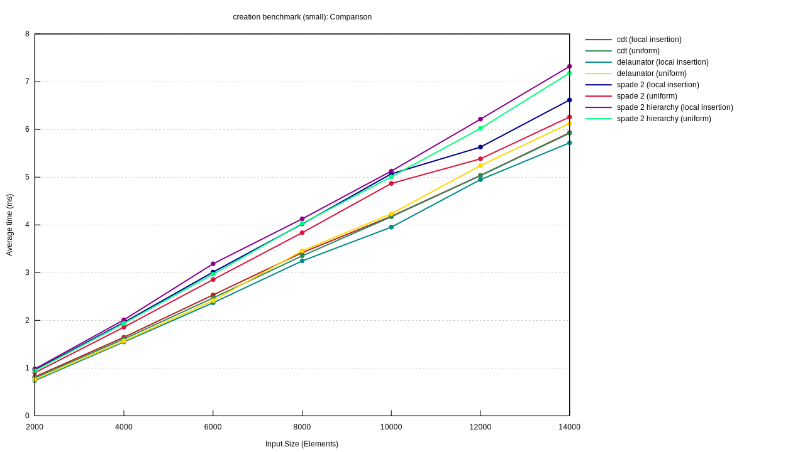
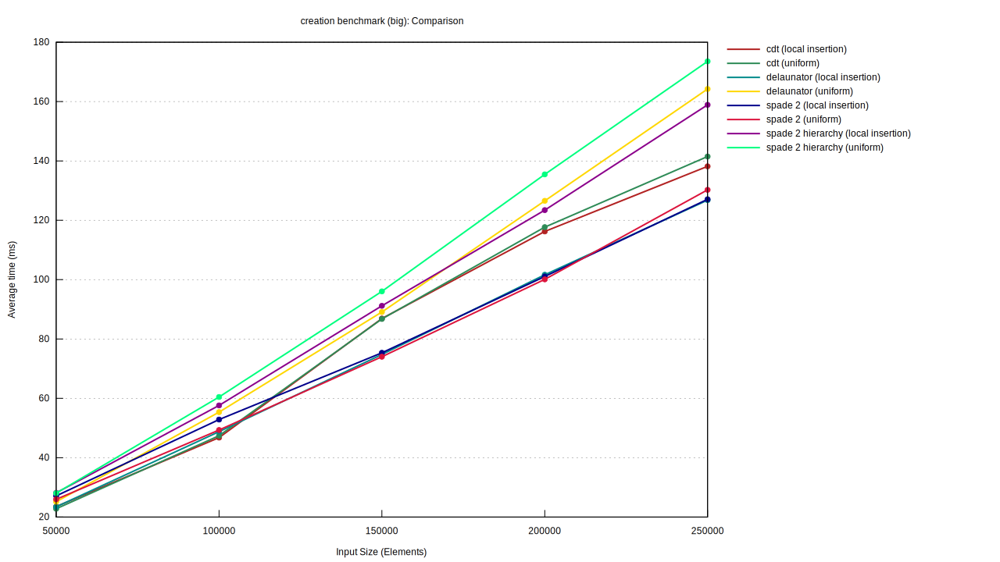

# delaunay_compare

Small benchmark suite for comparing different Delaunay triangulation implementations in rust.

## Crates under test

 - [delaunator 1.0.1](https://crates.io/crates/delaunator)
 - [cdt 0.1.0](https://crates.io/crates/cdt)
 - [spade 2.0](https://crates.io/crates/spade)

For spade: Both insertion *with* a lookup structure ("hierarchy") and *without* are being tested.
The look up structure allows efficient position lookup (e.g. for nearest neighbor searches) on the resulting triangulations but takes additional time to construct.

## Point distributions under test

Two point distributions are tested:
 - **uniform**: `f64` coordinates are uniformly distributed in a given interval
 - **local insertion**: consecutive input points are located close to each other. A point is generated by adding a random step (with a fixed maximum length) to the last inserted point (random walk). This creates a more skewed input set.

 ## How to run

 Clone this repository and run `cargo bench` inside the `delaunay_compare` folder.

 Results are stored in `<repository_root>/target/criterion`.

# Results

For better comparability, measurements are grouped in point sets with less than 14000 vertices ("small") and more than 50000 vertices ("big").

**Insertion times for small point sets:**

**Insertion times for big point sets:**

# Comparison & takeaways

 * All libraries are likely fast enough. For most applications it probably doesn't matter if inserting 14000 vertices takes 5.8 or 7.3 *milliseconds*.
 * For small triangulations, delaunator and cdt seem to have a slight edge. For big triangulations, spade (without hierarchy) appears to be favorable.
 * Use spade's `HierarchyHintGenerator` only if you really need it - it does come at some additional cost.

 # Additional feature comparison

bulk loading efficiency is not everything. The libraries also differ in which other features they support:

|                                                  |                   spade                  |             delaunator             |                 cdt                |
|--------------------------------------------------|:----------------------------------------:|:----------------------------------:|:----------------------------------:|
| bulk loading                                     |                     ✅                   |                  ✅                |                  ✅                |
| incremental insertion                            |                     ✅                   |                  ❌                |                  ❌                |
| extracting the Voronoi diagram                   |                     ✅                   |                  ❌                |                  ❌                |
| Constrained Delaunay triangulations (CDT)        |                     ✅                   |                  ❌                |                  ✅                |
| bulk loading support for CDTs                    |                     ❌                   |                  ❌                |                  ✅                |
| lookup structure for efficient searches          |                     ✅                   |                  ❌                |                  ❌                |
| use robust arithmetic predicates                 |                     ✅                   |                  ✅                |                  ✅                |
| custom types for edges, faces and vertices       |                     ✅                   |                  ❌                |                  ❌                |
| near-neighbors (points very close to each other) | regularly inserted                       | near neighbors get merged together | near neighbors get merged together |
| supported coordinate values                      | `abs(x) == 0` or 2^-142 < abs(x) < 2^201 | any `f64` value (can overflow)     | any `f64` value (can overflow)     |
| maximum number of vertices                       | roughly 2^32 / 6 ≈ **7.16*10^8**         |                                    | 2^64 / 6                           |

# Disclaimer

This comparison has been created by the author of `spade` and may be biased. Please open an issue if you spot any inaccuracies!

Also, this benchmark should ideally test more than just two different point distributions. Its quite likely that some implementations can handle irregular triangulations better than others.